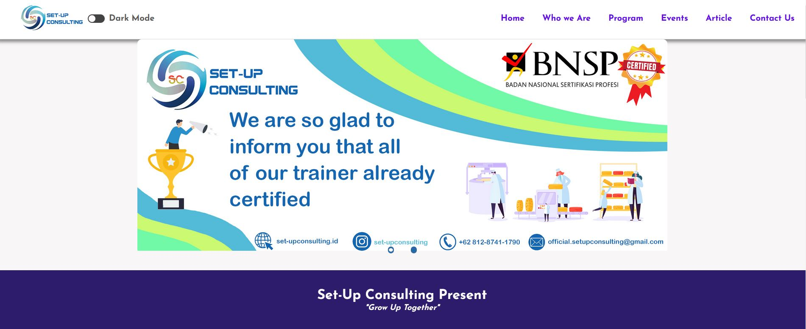

# This is the code of responsive HTML as Assignment study in week 2
This is an assignment for "responsive HTML as Assignment study in week 2"
***
# Description
Welcome to our project! This is a Set-Up Consulting Wbsite. It contain many program of food safety training. There Hazard Analysis Critical Control Point, Good Manufacturing Practices, Halal, and Legal Product. People can register training in website and contact Set-Up Consulting Company to held a food safety training. We hope you enjoy and we look forward to your contributions!
***

# Contributing
We welcome any and all contributions! Here are some ways you can get started:
1. GMP Training
2. HACCP Training
3. Halal Training
4. Legal Product Compliance
***

# Set-Up Conculting web display
This is the website of set-up consulting display

# Code made by Amiril Mukminin

**Result Sample Website** ([https://main--regal-peony-b7d643.netlify.app/](https://main--regal-peony-b7d643.netlify.app/))
