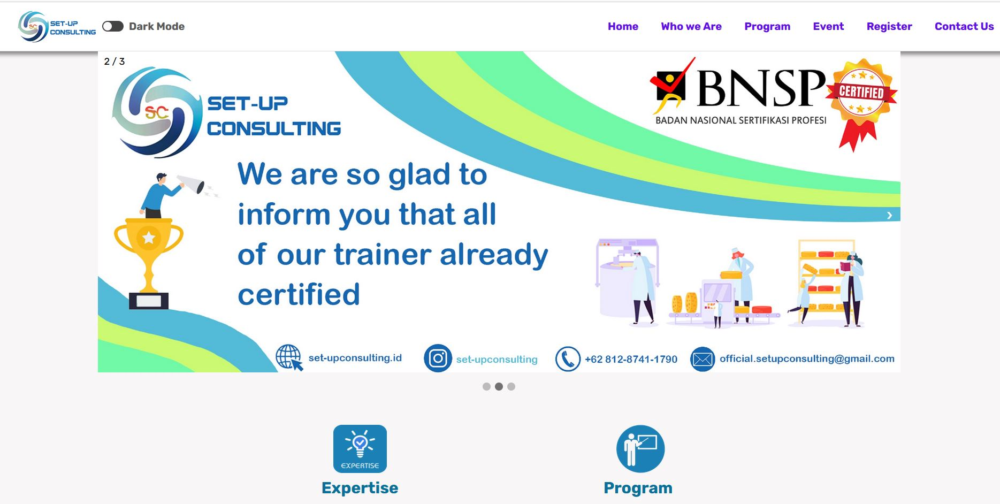

# This is the code of responsive HTML as Assignment study in week 2
This is an assignment for "responsive HTML as Assignment study of Milestone in Week 4"
***
# Description
Welcome to our project! This is a Set-Up Consulting Wbsite. It contain many program of food safety training. There Hazard Analysis Critical Control Point, Good Manufacturing Practices, Halal, and Legal Product. People can register training in website and contact Set-Up Consulting Company to held a food safety training. We hope you enjoy and we look forward to your contributions!
***

# Contributing
We welcome any and all contributions! Here are some ways you can get started:
1. GMP Training
2. HACCP Training
3. Halal Training
4. Legal Product Compliance
***

# Skill contain in web:
1. Semantic HTML
    - Use appropriate HTML tags to structure the content of the company page.
    - Use heading tags (h1,h2,etc) to present the hierarchy of headings.
    - Use paragraph tags (p) for textual content
    - Use list (ul,ol) for ordered or unordered information.
    - Use semantic tags such as a header, nav, main, sectin, and footer to provide meaningful structure to the page
    - Use appropriate tags for images, links, and other media elements.
2. Responsive design
    - Implement CSS media queries to make the company profile page responsive across different screen devices.
    - Ensure that the layout adapts smoothly to different screen sizes and orientations.
    - Use relative units (such as persentages or ems) for sizing elements to maintain a consistent layout across devices.
    - Adjust typoghrapy and font size to ensure readability on varoius screen size.
    - Optimize images and other media for different resolutions and device capabilities.
3. Documnetation
    - Create a readme file that provides clear instruction on how to set up and run the project
    - include Screenshots of the different stages of development, showcasing the process of building the page.
    - Clearly explain any dependencies in project
    - Document any specific design choices or considerations made during the development process
4. Deployment
    - Publish the company profile page to a custom domain.
    - Set up and configure a live server or hosting platform for the website deployment
    - Register a custom domain name and link it to the deployed webiste.
    - Ensure that the website is accesible and functional on the custom domain.

# Set-Up Conculting web display
This is the website of set-up consulting display

# Code made by Amiril Mukminin

**Result Sample Website** ([https://setupconsulting.web.id/](https://setupconsulting.web.id/))